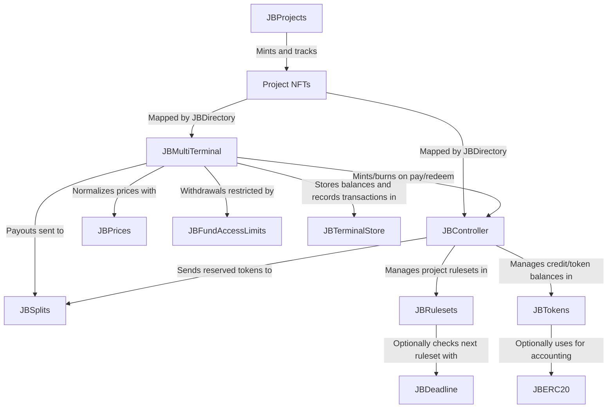

# Bananapus Core

This repository contains the core protocol contracts for Bananapus' Juicebox v4. Juicebox is a flexible toolkit for launching and managing a treasury-backed token on Ethereum and L2s.

<details>
  <summary>Table of Contents</summary>
  <ol>
    <li><a href="#usage">Usage</a></li>
  <ul>
    <li><a href="#install">Install</a></li>
    <li><a href="#develop">Develop</a></li>
    <li><a href="#scripts">Scripts</a></li>
    <li><a href="#deployments">Deployments</a></li>
    <li><a href="#tips">Tips</a></li>
    </ul>
    <li><a href="#repository-layout">Repository Layout</a></li>
    <li><a href="#architecture">Architecture</a></li>
  <ul>
    <li><a href="#core-contracts">Core Contracts</a></li>
    <li><a href="#surface-contracts">Surface Contracts</a></li>
    <li><a href="#utility-contracts">Utility Contracts</a></li>
    </ul>
    <li><a href="#example-usage">Example Usage</a></li>
    <li><a href="#conceptual-overview">Conceptual Overview</a></li>
  <ul>
    <li><a href="#rulesets">Rulesets</a></li>
    <li><a href="#distributing-funds">Distributing Funds</a></li>
    <ul>
      <li><a href="#payouts">Payouts</a></li>
      <li><a href="#surplus-allowance">Surplus Allowance</a></li>
      </ul>
    <li><a href="#payments-tokens-and-redemptions">Payments, Tokens, and Redemptions</a></li>
    <ul>
      <li><a href="#redemptions">Redemptions</a></li>
      </ul>
    <li><a href="#permissions">Permissions</a></li>
    <li><a href="#hooks">Hooks</a></li>
    <ul>
      <li><a href="#ruleset-approval-hook">Ruleset Approval Hook</a></li>
      <li><a href="#data-hooks">Data Hooks</a></li>
      <li><a href="#pay-hooks">Pay Hooks</a></li>
      <li><a href="#redeem-hooks">Redeem Hooks</a></li>
      <li><a href="#split-hooks">Split Hooks</a></li>
      </ul>
    <li><a href="#fees">Fees</a></li>
    <ul>
      <li><a href="#held-fees">Held Fees</a></li>
      <li><a href="#feeless-addresses">Feeless Addresses</a></li>
      </ul>
    </ul>
  </ul>
  </ol>
</details>

## Usage

### Install

How to install `nana-core` in another project.

For projects using `npm` to manage dependencies (recommended):

```bash
npm install @bananapus/core
```

For projects using `forge` to manage dependencies (not recommended):

```bash
forge install Bananapus/nana-core
```

If you're using `forge` to manage dependencies, add `@bananapus/core/=lib/nana-core/` to `remappings.txt`. You'll also need to install `nana-core`'s dependencies and add similar remappings for them.

### Develop

`nana-core` uses [npm](https://www.npmjs.com/) (version >=20.0.0) for package management and the [Foundry](https://github.com/foundry-rs/foundry) development toolchain for builds, tests, and deployments. To get set up, [install Node.js](https://nodejs.org/en/download) and install [Foundry](https://github.com/foundry-rs/foundry):

```bash
curl -L https://foundry.paradigm.xyz | sh
```

You can download and install dependencies with:

```bash
npm ci && forge install
```

If you run into trouble with `forge install`, try using `git submodule update --init --recursive` to ensure that nested submodules have been properly initialized.

Some useful commands:

| Command               | Description                                         |
| --------------------- | --------------------------------------------------- |
| `forge build`         | Compile the contracts and write artifacts to `out`. |
| `forge fmt`           | Lint.                                               |
| `forge test`          | Run the tests.                                      |
| `forge build --sizes` | Get contract sizes.                                 |
| `forge coverage`      | Generate a test coverage report.                    |
| `foundryup`           | Update foundry. Run this periodically.              |
| `forge clean`         | Remove the build artifacts and cache directories.   |

To learn more, visit the [Foundry Book](https://book.getfoundry.sh/) docs.

### Scripts

For convenience, several utility commands are available in `package.json`.

| Command             | Description                            |
| ------------------- | -------------------------------------- |
| `npm test`          | Run local tests.                       |
| `npm run test:fork` | Run fork tests (for use in CI).        |
| `npm run coverage`  | Generate an LCOV test coverage report. |

### Deployments

`nana-core` is deployed using [Sphinx](https://github.com/sphinx-labs/sphinx), an automated smart contract deployment platform for Foundry. To run the deployment scripts, first install the npm `devDependencies` by running `npm install`. You'll also need to set up a `.env` file based on `.example.env`. Then run one of the following commands:

| Command                   | Description         |
| ------------------------- | ------------------- |
| `npm run deploy:mainnets` | Deploy to mainnets. |
| `npm run deploy:testnets` | Deploy to testnets. |

### Tips

To view test coverage, run `npm run coverage` to generate an LCOV test report. You can use an extension like [Coverage Gutters](https://marketplace.visualstudio.com/items?itemName=ryanluker.vscode-coverage-gutters) to view coverage in your editor.

If you're using Nomic Foundation's [Solidity](https://marketplace.visualstudio.com/items?itemName=NomicFoundation.hardhat-solidity) extension in VSCode, you may run into LSP errors because the extension cannot find dependencies outside of `lib`. You can often fix this by running:

```bash
forge remappings >> remappings.txt
```

This makes the extension aware of default remappings.

## Repository Layout

The root directory contains this README, an MIT license, and config files.

The important source directories are:

```
nana-core/
├── script/ - Contains the forge deploy script.
├── src/ - The Solidity source code for the contracts. Top level contains implementation contracts.
│   ├── abstract/ - Abstract utility contracts.
│   ├── enums/ - Enums.
│   ├── interfaces/ - Contract interfaces.
│   ├── libraries/ - Libraries.
│   └── structs/ - Structs.
└── test/ - Forge tests and testing utilities. Top level contains the main test files.
    ├── helpers/ - Generic helpers.
    ├── mock/ - Mocking utilities.
    ├── trees/ - Tree descriptions of unit test flows.
    └── units/ - Unit tests.
```

Other directories:

```
nana-core/
├── .github/
│   └── workflows/ - CI/CD workflows.
├── deployments/ - Sphinx deployment logs.
└── utils/ - Miscellaneous utility scripts.
```

## Architecture



### Core Contracts

| Contract                                                                                            | Description                                                                                                                                                                                    |
| --------------------------------------------------------------------------------------------------- | ---------------------------------------------------------------------------------------------------------------------------------------------------------------------------------------------- |
| [`JBProjects`](https://github.com/Bananapus/nana-core/blob/main/src/JBProjects.sol)                 | Stores project ownership and metadata. Projects are represented as ERC-721s.                                                                                                                   |
| [`JBRulesets`](https://github.com/Bananapus/nana-core/blob/main/src/JBRulesets.sol)                 | Manages rulesets and queuing for all projects. Rulesets dictate how a project behaves for a period of time.                                                                                    |
| [`JBTokens`](https://github.com/Bananapus/nana-core/blob/main/src/JBTokens.sol)                     | Manages minting, burning, and balances of projects' tokens and token credits.                                                                                                                  |
| [`JBPermissions`](https://github.com/Bananapus/nana-core/blob/main/src/JBPermissions.sol)           | Stores permissions for all addresses and operators. Addresses can give permissions to any other address (i.e. an _operator_) to execute specific Juicebox protocol operations on their behalf. |
| [`JBDirectory`](https://github.com/Bananapus/nana-core/blob/main/src/JBDirectory.sol)               | Tracks the terminals and the controller that each project is using.                                                                                                                            |
| [`JBFundAccessLimits`](https://github.com/Bananapus/nana-core/blob/main/src/JBFundAccessLimits.sol) | Stores and manages payout limits and surplus allowance limits for each project, restricting the amount of funds each project can access from its terminals.                                    |
| [`JBPrices`](https://github.com/Bananapus/nana-core/blob/main/src/JBPrices.sol)                     | Manages and normalizes price feeds for use in terminals. Price feeds are contracts which return the "pricing currency" cost of 1 "unit currency".                                              |
| [`JBSplits`](https://github.com/Bananapus/nana-core/blob/main/src/JBSplits.sol)                     | Stores and manages splits for each project. Split groups are lists of wallets and projects which each receive a percent of a project's payouts or reserved tokens.                             |

### Surface Contracts

The surface contracts are the entry points for external interactions with the Juicebox protocol, and define how the core contracts are used together. Anyone can write new surface contracts for projects to use.

| Contract                                                                                      | Description                                                                                                                                                                  |
| --------------------------------------------------------------------------------------------- | ---------------------------------------------------------------------------------------------------------------------------------------------------------------------------- |
| [`JBController`](https://github.com/Bananapus/nana-core/blob/main/src/JBController.sol)       | Coordinates rulesets and project tokens, and is the entry point for most operations related to rulesets and project tokens.                                                  |
| [`JBMultiTerminal`](https://github.com/Bananapus/nana-core/blob/main/src/JBMultiTerminal.sol) | Manages native/ERC-20 payments, redemptions, and surplus allowance usage for any number of projects. The entry point for operations involving inflows and outflows of funds. |
| [`JBTerminalStore`](https://github.com/Bananapus/nana-core/blob/main/src/JBTerminalStore.sol) | Manages bookkeeping for inflows and outflows of funds from any terminal addresses.                                                                                           |

A project's current controller and terminals can be found (or updated) through [`JBDirectory`](https://github.com/Bananapus/nana-core/blob/main/src/JBDirectory.sol).

### Utility Contracts

| Contract                                                                                                    | Description                                                                                                                                                                                                    |
| ----------------------------------------------------------------------------------------------------------- | -------------------------------------------------------------------------------------------------------------------------------------------------------------------------------------------------------------- |
| [`JBFeelessAddresses`](https://github.com/Bananapus/nana-core/blob/main/src/JBFeelessAddresses.sol)         | Stores a list of addresses that shouldn't incur fees.                                                                                                                                                          |
| [`JBChainlinkV3PriceFeed`](https://github.com/Bananapus/nana-core/blob/main/src/JBChainlinkV3PriceFeed.sol) | An `IJBPriceFeed` implementation that reports prices from a Chainlink `AggregatorV3Interface`.                                                                                                                 |
| [`JBDeadline`](https://github.com/Bananapus/nana-core/blob/main/src/JBDeadline.sol)                         | A ruleset approval hook which rejects rulesets if they are not queued at least `duration` seconds before the current ruleset ends. In other words, rulesets must be queued before the deadline to take effect. |
| [`JBERC20`](https://github.com/Bananapus/nana-core/blob/main/src/JBERC20.sol)                               | An ERC-20 token which project have the option of using in `JBTokens` and `JBController`.                                                                                                                       |

## Example Usage

_For a thorough core protocol overview, see the [Conceptual Overview](#conceptual-overview) section._

Jeff wants to raise funds for his startup, "Bingle". He decides to launch a Bingle Juicebox project on Ethereum mainnet. To launch his project, he calls [`JBController.launchProjectFor(…)`](https://github.com/Bananapus/nana-core/blob/main/src/JBController.sol#L291), passing the following arguments:

| Param                    | Value                                            | Why                                                                                                                  |
| ------------------------ | ------------------------------------------------ | -------------------------------------------------------------------------------------------------------------------- |
| `owner`                  | `bingle.eth`                                     | This is the Bingle multisig, which Jeff wants to use to safely manage the project.                                   |
| `projectUri`             | `QmQHGuXv7nDh1rxj48HnzFtwvVxwF1KU9AfB6HbfG8fmJF` | This IPFS hash points to a JSON file with the [Bingle metadata](https://docs.juicebox.money/dev/frontend/metadata/). |
| `rulesetConfigurations`  | `[…]`                                            | More below.                                                                                                          |
| `terminalConfigurations` | `[…]`                                            | More below.                                                                                                          |
| `memo`                   | `"Bingle is the best startup in the world."`     | This memo is included in the event emitted by the project's launch.                                                  |

His `rulesetConfigurations` array only contains a single ruleset, and looks like this:

```js
[
  {
    "mustStartAtOrAfter": 1, // Jeff's ruleset takes effect immediately.
    "duration": 604_800, // The ruleset lasts for a week (which is 604,800 seconds).
    "weight": 100_000_000_000_000_000_000, // The ruleset mints 100 tokens (with 18 decimals) per unit of payment.
    "decayRate": 100_000_000, // The weight decays by 10% each cycle. Calculated out of `JBConstants.MAX_DECAY_RATE` (1e9).
    "approvalHook": "0x123…", // This is the address of the `JBDeadline` approval hook with a 24 hour duration (86,400 seconds).
    "metadata": {
      "reservedRate": 3_000, // Jeff reserves 30% of the tokens minted while this ruleset is active. Calculated out of `JBConstants.MAX_RESERVED_RATE` (1e4).
      "redemptionRate": 10_000, // Jeff allows 1:1 redemptions for the tokens minted while this ruleset is active. Calculated out of `JBConstants.MAX_REDEMPTION_RATE` (1e4).
      "baseCurrency": "0x000000000000000000000000000000000000EEEe", // Jeff uses `JBConstants.NATIVE_TOKEN` (ETH) as the base currency.
      "pausePay": false, // Jeff allows payments to the project.
      "pauseCreditTransfers": false, // Jeff allows payers to transfer their credits.
      "allowOwnerMinting": false, // Jeff doesn't allow the Bingle multisig to mint credits/tokens on demand.
      /* Jeff doesn't allow the Bingle multisig to migrate or set terminals or controllers during the ruleset. */
      "allowTerminalMigration": false,
      "allowSetTerminals": false,
      "allowControllerMigration": false,
      "allowSetController": false,
      "holdFees": false, // Jeff pays fees when they're incurred.
      "useTotalSurplusForRedemptions": true, // Bingle credit/token holders can redeem from the project's total surplus across all terminals, and not just the local terminal surplus.
      /* The Bingle project doesn't use a data hook for payments or redemptions. */
      "useDataHookForPay": false,
      "useDataHookForRedeem": false,
      "dataHook": "0x0000000000000000000000000000000000000000",
      "metadata": 0 // This ruleset doesn't need any metadata.
    },
    "splitGroups": [
      {
        1, // This splitGroupId comes from `JBSplitGroupIds.RESERVED_TOKENS`. This group is for reserved tokens.
        [
          {
            "preferAddToBalance": false, // Typically used for payouts to projects. If true, it uses `addToBalanceOf(…)`. If false, it will `pay(…)` the project.
            "percent": 250_000_000, // 25% of `JBConstants.SPLITS_TOTAL_PERCENT` (1e9).
            "projectId": 5, // This split is paid to project #5, which helps Bingle with marketing.
            "beneficiary": "0x456…", // Any tokens minted by this split's payment go to Jeff's friend (with wallet 0x456…).
            "lockedUntil": 0, // This split can be changed by the Bingle multisig at any time.
            "hook": "0x0000000000000000000000000000000000000000" // This split doesn't use a split hook.
          },
          {
            "preferAddToBalance": false,
            "percent": 300_000_000, // 30% of `JBConstants.SPLITS_TOTAL_PERCENT` (1e9).
            "projectId": 0, // This split is paid directly to the `beneficiary` address, not a project.
            "beneficiary": "0x456…", // This is Jeff's friend, who helped him set up the project.
            "lockedUntil": 0, // This split can be changed by the Bingle multisig at any time.
            "hook": "0x0000000000000000000000000000000000000000" // This split doesn't use a split hook.
          }
        ]
      }
    ],
    "fundAccessLimitGroups": [
    	{
    	  "terminal": "0x789…", // This is the address of `JBMultiTerminal`, which the Bingle project uses to manage payouts.
    	  "token": "0x000000000000000000000000000000000000EEEe", // These limits determine how much ETH (`JBConstants.NATIVE_TOKEN`) can be paid out from the terminal.
    	  "payoutLimits": [
            {
              "amount": 1_000_000_000_000_000_000, // 1 (with 18 decimals).
	      "currency": 0 // ETH (see `JBCurrencyIds`).
            },
	  ],
    	  "surplusAllowances": [] // Jeff doesn't allow any surplus allowance usage.
    	}
    ]
  }
]
```

Some things to note:

- Jeff only sets up a single ruleset, which takes effect immediately and lasts for a week. Unless he queues another ruleset at least 24 hours before the end of this ruleset (as required by the `JBDeadline` approval hook), this ruleset will cycle indefinitely. Each time it cycles, the `weight` will decay by 10%.
- Jeff only specified a single split group, which is for reserved tokens. 25% of the tokens minted while the ruleset is active to project #5, and 30% go to his friend's wallet. The remaining 45% go to the project's owner (the Bingle multisig).
- Jeff set up a single fund access limit group for `JBMultiTerminal`. This group restricts payouts to 1 ETH per ruleset, but this resets when the ruleset cycles over. Jeff didn't set up any surplus allowance limits, so he can't withdraw surplus funds from the terminal. Since Jeff didn't specify any split groups for payouts, all payouts go to the project's owner (the Bingle multisig).

For a detailed description of the fields in the structs above, see the natspec documentation for [`JBRulesetConfig`](https://github.com/Bananapus/nana-core/blob/main/src/structs/JBRulesetConfig.sol), [`JBRulesetMetadata`](https://github.com/Bananapus/nana-core/blob/main/src/structs/JBRulesetMetadata.sol), [`JBSplitGroup`](https://github.com/Bananapus/nana-core/blob/main/src/structs/JBSplitGroup.sol), [`JBSplit`](https://github.com/Bananapus/nana-core/blob/main/src/structs/JBSplit.sol), [`JBFundAccessLimitGroup`](https://github.com/Bananapus/nana-core/blob/main/src/structs/JBFundAccessLimitGroup.sol), and [`JBCurrencyAmount`](https://github.com/Bananapus/nana-core/blob/main/src/structs/JBCurrencyAmount.sol).

His `terminalConfigurations` array sets up two terminals. The first is the [`JBMultiTerminal`](https://github.com/Bananapus/nana-core/blob/main/src/JBMultiTerminal.sol), which the Bingle project uses to accept ETH payouts, make redemptions available, and manage payouts. The second terminal is the [`JBSwapTerminal`](https://github.com/Bananapus/nana-swap-terminal/blob/main/src/JBSwapTerminal.sol), which the Bingle project uses to accept USDC and convert them to ETH on payment (for a more detailed explanation, see [`nana-swap-terminal`](https://github.com/Bananapus/nana-swap-terminal)). The `terminalConfigurations` look like this:

```js
[
  {
    "terminal": "0x789…", // This is the address of `JBMultiTerminal`.
    "tokensToAccept": ["0x000000000000000000000000000000000000EEEe"] // The Bingle project accepts ETH (`JBConstants.NATIVE_TOKEN`) through this terminal.
  },
  {
    "terminal": "0xABC…", // This is the address of `JBSwapTerminal`.
    "tokensToAccept": ["0xA0b86991c6218b36c1d19D4a2e9Eb0cE3606eB48"] // The Bingle project accepts USDC through the swap terminal.
  }
]
```

Note that Jeff didn't have to set his controller – the controller he calls `launchProjectFor(…)` on sets itself as the project's controller in the [`JBDirectory`](https://github.com/Bananapus/nana-core/blob/main/src/JBDirectory.sol).

The controller also mints the [`JBProjects`](https://github.com/Bananapus/nana-core/blob/main/src/JBProjects.sol) ERC-721 which represents the project into the Bingle multisig's wallet, stores the project's metadata, queues the first ruleset, and sets up the terminals in the directory. The Bingle project is now live on Ethereum mainnet!

## Conceptual Overview

Juicebox is a flexible toolkit for launching and managing a treasury-backed token on EVMs.

There are two main entry points for interacting with a Juicebox project:

1. The project's terminals, which are the entry point for operations involving inflows and outflows of funds – payments, redemptions, payouts, and surplus allowance usage (more on this under [_Surplus Allowance_](#surplus-allowance)). Each project can use multiple terminals, and a single deployed terminal can be used by many projects.
2. The project's controller, which is the entry point for most operations related to a project's rulesets (more on this later) and its tokens.

`nana-core` provides a trusted and well-understood implementation for each: [`JBMultiTerminal`](https://github.com/Bananapus/nana-core/blob/main/src/JBMultiTerminal.sol) is a generic terminal which manages payments, redemptions, payouts, and surplus allowance spending (more on this later) in native/ERC-20 tokens, and [`JBController`](https://github.com/Bananapus/nana-core/blob/main/src/JBController.sol) is a straightforward controller which coordinates rulesets (more on this under [_Rulesets_](#rulesets)) and project tokens. Projects can also bring their own terminals (which implement [`IJBTerminal`](https://github.com/Bananapus/nana-core/blob/main/src/interfaces/IJBTerminal.sol)), or their own controllers (which implement [`IJBController`](https://github.com/Bananapus/nana-core/blob/main/src/interfaces/IJBController.sol)).

If the project's rules allow it, a project can migrate from one controller to another one with [`JBController.migrateController(…)`](https://github.com/Bananapus/nana-core/blob/main/src/JBController.sol#L539), or from one terminal to another with [`JBMultiTerminal.migrateBalanceOf(…)`](https://github.com/Bananapus/nana-core/blob/main/src/JBMultiTerminal.sol#L467).

[`JBDirectory`](https://github.com/Bananapus/nana-core/blob/main/src/JBDirectory.sol) stores mappings of each project's current controller and terminals. It also stores their primary terminals – the primary terminal for a token is where payments in that token are routed to by default.

To launch a Juicebox project, any address can call [`JBController.launchProjectFor(…)`](https://github.com/Bananapus/nana-core/blob/main/src/JBController.sol#L291), which will:

1. Mint the project's ERC-721 into the owner's wallet. Whoever owns this NFT is the project's owner, and has permission to manage the project's rules. These NFTs are stored in the [`JBProjects`](https://github.com/Bananapus/nana-core/blob/main/src/JBProjects.sol) contract.
2. Store the project's metadata (if provided). This is typically an IPFS hash pointing to a [JSON file with the project's name, description, and logo](https://docs.juicebox.money/dev/frontend/metadata/), but clients can use any metadata schema they'd like.
3. Set itself (the controller being called) as the project's controller in the [`JBDirectory`](https://github.com/Bananapus/nana-core/blob/main/src/JBDirectory.sol).
4. Queue the first rulesets. More on this below.
5. Set up any provided terminals as the project's terminals in the [`JBDirectory`](https://github.com/Bananapus/nana-core/blob/main/src/JBDirectory.sol).

### Rulesets

The rules which dictate a project's behavior—including what happens when the project is paid, how its funds can be accessed, and how the project's rules can change in the future—are expressed as a queue of _rulesets_. A ruleset is a list of all the rules that currently apply to a project, which lasts for a pre-defined duration. The project's owner can add new rulesets to the end of the queue at any time by calling [`JBController.queueRulesetsOf(…)`](https://github.com/Bananapus/nana-core/blob/main/src/JBController.sol#L376).

Rulesets are stored and managed by the [`JBRulesets`](https://github.com/Bananapus/nana-core/blob/main/src/JBRulesets.sol) contract, and are represented by the [`JBRuleset`](https://github.com/Bananapus/nana-core/blob/main/src/structs/JBRuleset.sol) and [`JBRulesetMetadata`](https://github.com/Bananapus/nana-core/blob/main/src/structs/JBRulesetMetadata.sol) structs. As mentioned above, the entry point for ruleset operations is the project's controller.

When a ruleset ends:

- If there are rulesets in the queue, the project will move on to the next one.
- If the ruleset queue is empty, the current ruleset keeps cycling (_i.e._ re-starting with the same duration).

As a special case, if the ruleset queue is empty AND the current ruleset has a duration of `0`, it lasts indefinitely. In this situation, when a new ruleset is queued, it will go into effect immediately.

Rulesets give project creators the ability to update their project's rules over time, and also allows them to offer supporters contractual guarantees about the project's future. A properly designed ruleset can guarantee refunds to supporters, or make certain kinds of rugpulls impossible.

Projects can further constrain their ability to change the project's rules with an _approval hook_ (more on this under [_Hooks_](#hooks)). This is a customizable contract attached to each ruleset, used to determine whether the next ruleset in the queue is approved to take effect. `nana-core` provides the [`JBDeadline`](https://github.com/Bananapus/nana-core/blob/main/src/JBDeadline.sol) approval hook, which rejects rulesets if they are not queued at least `N` seconds before the current ruleset ends. In other words, rulesets must be queued before a deadline to take effect. `JBDeadline` offers a clear window during which supporters can review upcoming changes and react to them (for example, by redeeming or selling their project tokens) before they are implemented.

### Distributing Funds

Aside from redemptions (see [_Redemptions_](#redemptions)), funds can be accessed from a project's terminals in two ways: payouts or surplus allowance.

#### Payouts

Payouts are the primary way a project can distribute funds from its terminals. Anyone can send a project's payouts with [`JBMultiTerminal.sendPayoutsOf(…)`](https://github.com/Bananapus/nana-core/blob/main/src/JBMultiTerminal.sol#L397), which pays out funds within the bounds of the ruleset's pre-defined payout limits:

Each ruleset is associated with a list of _payout limits_, which are stored in [`JBFundAccessLimits`](https://github.com/Bananapus/nana-core/blob/main/src/JBFundAccessLimits.sol). Each payout limit specifies an amount of funds that can be withdrawn from a project's terminals in terms of a specific currency. If a payout limit's currency is different from the currency used in a terminal, the amount of funds which can be paid out from that terminal varies depending on their exchange rate, as reported by [`JBPrices`](https://github.com/Bananapus/nana-core/blob/main/src/JBPrices.sol). Payout limits can only be set by the project's controller, and are set when a ruleset is queued.

The sum of a ruleset's payout limits is the maximum amount of funds a project can pay out from its terminals during that ruleset. By default, all payouts go to the project's owner, but the owner can send payouts to multiple _splits_, which are other wallets or projects which will receive a percent of the payouts. Splits are stored and managed by [`JBSplits`](https://github.com/Bananapus/nana-core/blob/main/src/JBSplits.sol) – you can learn how splits are represented in the [`JBSplit`](https://github.com/Bananapus/nana-core/blob/main/src/structs/JBSplit.sol) struct.

Splits are stored slightly differently from the project's other rules, and can be changed by the project's owner at any time (independently of the ruleset) with [`JBController.setSplitGroupsOf(…)`](https://github.com/Bananapus/nana-core/blob/main/src/JBController.sol#L593) unless they are locked – splits have an optional `lockedUntil` timestamp which prevents them from being changed until that time has passed.

Payout limits reset at the start of each ruleset – projects can use rulesets as a regular cadence for recurring payouts. If payouts are not sent out during a ruleset, the funds stay in the project's terminals.

Funds in excess of the payout limits are "surplus funds". Surplus funds stay in the terminals, serving as a runway for payouts in future rulesets. If the project has redemptions enabled, token holders can redeem their tokens to reclaim some of the surplus funds.

#### Surplus Allowance

Project creators also have the option to withdraw surplus funds from a terminal with [`JBMultiTerminal.useAllowanceOf(…)`](https://github.com/Bananapus/nana-core/blob/main/src/JBMultiTerminal.sol#L432), which withdraws surplus funds for the `beneficiary` specified by the project owner up to the pre-defined surplus allowance limit:

Like payout limits, surplus allowance limits are stored in [`JBFundAccessLimits`](https://github.com/Bananapus/nana-core/blob/main/src/JBFundAccessLimits.sol), and each surplus allowance limit specifies an amount of funds that can be withdrawn from a project's terminals in terms of a specific currency. Surplus allowance limits can only be set by the project's controller, and are set when a ruleset is queued.

_Unlike_ payout limits, the surplus allowance **does not** reset at the start of each ruleset – once the surplus allowance is used, a new surplus allowance must be initialized by the controller before further surplus can be withdrawn. Surplus allowance is sometimes used for discretionary spending. Most projects use a surplus allowance of `0`, meaning the owner cannot withdraw surplus funds.

### Payments, Tokens, and Redemptions

Juicebox project can receive funds in two ways:

1. Funds can simply be added to a project's balance in a terminal with [`JBMultiTerminal.addToBalanceOf(…)`](https://github.com/Bananapus/nana-core/blob/main/src/JBMultiTerminal.sol).
2. More often, a project is paid with [`JBMultiTerminal.pay(…)`](https://github.com/Bananapus/nana-core/blob/main/src/JBMultiTerminal.sol), minting credits or tokens for the payer or a beneficiary they specify.

By default, the [`JBTokens`](https://github.com/Bananapus/nana-core/blob/main/src/JBTokens.sol) contract tracks credit balances for a project's payers. Credits are a simple accounting mechanism – they can be transferred with [`JBController.transferCreditsFrom(…)`](https://github.com/Bananapus/nana-core/blob/main/src/JBController.sol#L686), or redeemed with [`JBMultiTerminal.redeemTokensOf(…)`](https://github.com/Bananapus/nana-core/blob/main/src/JBMultiTerminal.sol#L355) (redeeming reclaims some funds from the project's terminal – read more under [_Redemptions_](#redemptions)).

A project's creator can call [`JBController.deployERC20For(…)`](https://github.com/Bananapus/nana-core/blob/main/src/JBController.sol#L620) to deploy a [`JBERC20`](https://github.com/Bananapus/nana-core/blob/main/src/JBERC20.sol) token for their project which can be traded on exchanges, used for on-chain voting (`JBERC20` implements `ERC20Votes`), and more. From then on, [`JBTokens`](https://github.com/Bananapus/nana-core/blob/main/src/JBTokens.sol) will track balances in both credits _and_ the ERC-20 token. Credit holders can use [`JBController.claimTokensFor(…)`](https://github.com/Bananapus/nana-core/blob/main/src/JBController.sol#L664) to exchange their credits for the ERC-20 tokens, and like credits, tokens can be redeemed with [`JBMultiTerminal.redeemTokensOf(…)`](https://github.com/Bananapus/nana-core/blob/main/src/JBMultiTerminal.sol#L355).

Project creators can bring their own token as long as it implements [`IJBToken`](https://github.com/Bananapus/nana-core/blob/main/src/interfaces/IJBToken.sol), and set it as their project's token using [`JBController.setTokenFor(…)`](https://github.com/Bananapus/nana-core/blob/main/src/JBController.sol#L647).

When someone pays a project, the number of credits or tokens they receive is determined by the ruleset:

1. If the payment is not in the ruleset's _base currency_ ([`JBRulesetMetadata.baseCurrency`](https://github.com/Bananapus/nana-core/blob/main/src/structs/JBRulesetMetadata.sol)), use [`JBPrices`](https://github.com/Bananapus/nana-core/blob/main/src/JBPrices.sol) to figure out how much the payment is worth in terms of the base currency. For example, if the base currency is USD and the payment is in ETH, use an ETH/USD price feed (like [`JBChainlinkV3PriceFeed`](https://github.com/Bananapus/nana-core/blob/main/src/JBChainlinkV3PriceFeed.sol)) to convert the payment to USD.
2. The value, now expressed in terms of the base currency, gets multiplied by the ruleset's _weight_ ([`JBRuleset.weight`](https://github.com/Bananapus/nana-core/blob/main/src/structs/JBRuleset.sol)) to determine the number of credits or tokens that will be minted.
3. The number of credits or tokens the beneficiary receives is then reduced by the ruleset's _reserved rate_ ([`JBRulesetMetadata.reservedRate`](https://github.com/Bananapus/nana-core/blob/main/src/structs/JBRulesetMetadata.sol) expressed as a fraction out of [`JBConstants.MAX_RESERVED_RATE`](https://github.com/Bananapus/nana-core/blob/main/src/libraries/JBConstants.sol)). For example, if the reserved rate is 20%, the beneficiary will receive 80% of the tokens minted by the payment. The remaining 20% is reserved for a list of reserved splits which are managed by [`JBSplits`](https://github.com/Bananapus/nana-core/blob/main/src/JBSplits.sol) (just like [payout splits](#payouts)).

If the ruleset queue is empty and a ruleset is cycling (re-starting each time it ends), the ruleset's _decay rate_ ([`JBRuleset.decayRate`](https://github.com/Bananapus/nana-core/blob/main/src/structs/JBRuleset.sol), expressed as a fraction out of [`JBConstants.MAX_DECAY_RATE`](https://github.com/Bananapus/nana-core/blob/main/src/libraries/JBConstants.sol)) automatically reduces the weight each cycle. With a 5% decay rate, the weight gets reduced to 95% of its initial value in the second cycle, 90.25% in the third, and so on. This can be used to reward early supporters for taking on more risk without the need to manually queue new cycles.

#### Redemptions

Credits and project tokens can be redeemed to reclaim some funds from the treasury with [`JBMultiTerminal.redeemTokensOf(…)`](https://github.com/Bananapus/nana-core/blob/main/src/JBMultiTerminal.sol#L355). Only funds not being used for payouts (surplus funds) are available for redemption, so if a project's combined payout limits exceed its combined terminal balances, it can't be redeemed from. Redemptions are influenced by the ruleset's _redemption rate_ ([`JBRulesetMetadata.redemptionRate`](https://github.com/Bananapus/nana-core/blob/main/src/structs/JBRulesetMetadata.sol), expressed as a fraction out of [`JBConstants.MAX_REDEMPTION_RATE`](https://github.com/Bananapus/nana-core/blob/main/src/libraries/JBConstants.sol)):

1. With a 0% redemption rate, redemptions are turned off.
2. With a 100% redemption rate, redemptions are 1:1 — somebody redeeming 10% of all project tokens will receive 10% of the surplus funds.
3. Between 0% and 100%, redemptions are scaled down by the redemption rate. For example, with a 50% redemption rate, somebody redeeming 10% of all project tokens will receive **about** $10\% \times 50\% = 5\%$ of the surplus funds. The other ~5% stays in the project, _increasing the redemption value of everyone else's tokens_ (because the ratio of surplus to tokens has increased).

The lower the redemption rate, the more of an incentive for token holders to redeem later than others – earlier redeemers receive less of the surplus than later ones. The majority of projects use a redemption rate of 0% (redemptions disabled) or 100% (1:1 redemptions).

<details>
  <summary>Redemption Bonding Curve</summary>
  
With a 50% redemption rate, somebody redeeming 10% of all project tokens technically receives **slightly more** than 5% of the surplus funds. This is because a redemption rate between 0% and 100% enables redemptions along a bonding curve. Specifically, the formula is:

$$f(x) = \frac{s \cdot x}{t} \times \left( r + \frac{x(1 - r)}{t} \right)$$

Where:

- $f(x)$ is the amount of funds reclaimed by redeeming $x$ tokens,
- $r$ is the redemption rate (from 0 to 1),
- $s$ is the amount of surplus funds (the funds available for redemption), and
- $t$ is the current token supply.

</details>

### Permissions

[`JBPermissions`](https://github.com/Bananapus/nana-core/blob/main/src/JBPermissions.sol) allows one address to grant another address permission to call functions in Juicebox contracts on their behalf. Each ID in [`JBPermissionIds`](https://github.com/Bananapus/nana-permission-ids/blob/master/src/JBPermissionIds.sol) grants access to a specific set of these functions, which can be granted to another address with [`JBPermissions.setPermissionsFor(…)`](https://github.com/Bananapus/nana-core/blob/main/src/JBPermissions.sol#L105).

For example, if `alice.eth` owns project ID #5, she can queue new rulesets for the project. If `alice.eth` gives `bob.eth` permission to `QUEUE_RULESETS`, `bob.eth` can also queue rulesets for project ID #5.

<details>
  <summary>Permission IDs</summary>

| ID  | Name                            | Description                                                                                        | Used By                                                                     |
| --- | ------------------------------- | -------------------------------------------------------------------------------------------------- | --------------------------------------------------------------------------- |
| 1   | `ROOT`                          | All permissions across every contract. Very dangerous.                                             |                                                                             |
| 2   | `QUEUE_RULESETS`                | Permission to call `JBController.queueRulesetsOf` and `JBController.launchRulesetsFor`.            | [`nana-core`](https://github.com/Bananapus/nana-core)                       |
| 3   | `REDEEM_TOKENS`                 | Permission to call `JBMultiTerminal.redeemTokensOf`.                                               | [`nana-core`](https://github.com/Bananapus/nana-core)                       |
| 4   | `MIGRATE_CONTROLLER`            | Permission to call `JBController.migrateController`.                                               | [`nana-core`](https://github.com/Bananapus/nana-core)                       |
| 5   | `MIGRATE_TERMINAL`              | Permission to call `JBMultiTerminal.migrateBalanceOf`.                                             | [`nana-core`](https://github.com/Bananapus/nana-core)                       |
| 6   | `SET_PROJECT_METADATA`          | Permission to call `JBController.setUriOf`.                                                        | [`nana-core`](https://github.com/Bananapus/nana-core)                       |
| 7   | `DEPLOY_ERC20`                  | Permission to call `JBController.deployERC20For`.                                                  | [`nana-core`](https://github.com/Bananapus/nana-core)                       |
| 8   | `SET_TOKEN`                     | Permission to call `JBController.setTokenFor`.                                                     | [`nana-core`](https://github.com/Bananapus/nana-core)                       |
| 9   | `MINT_TOKENS`                   | Permission to call `JBController.mintTokensOf`.                                                    | [`nana-core`](https://github.com/Bananapus/nana-core)                       |
| 10  | `BURN_TOKENS`                   | Permission to call `JBController.burnTokensOf`.                                                    | [`nana-core`](https://github.com/Bananapus/nana-core)                       |
| 11  | `CLAIM_TOKENS`                  | Permission to call `JBController.claimTokensFor`.                                                  | [`nana-core`](https://github.com/Bananapus/nana-core)                       |
| 12  | `TRANSFER_CREDITS`              | Permission to call `JBController.transferCreditsFrom`.                                             | [`nana-core`](https://github.com/Bananapus/nana-core)                       |
| 13  | `SET_CONTROLLER`                | Permission to call `JBDirectory.setControllerOf`.                                                  | [`nana-core`](https://github.com/Bananapus/nana-core)                       |
| 14  | `SET_TERMINALS`                 | Permission to call `JBDirectory.setTerminalsOf`.                                                   | [`nana-core`](https://github.com/Bananapus/nana-core)                       |
| 15  | `SET_PRIMARY_TERMINAL`          | Permission to call `JBDirectory.setPrimaryTerminalOf`.                                             | [`nana-core`](https://github.com/Bananapus/nana-core)                       |
| 16  | `USE_ALLOWANCE`                 | Permission to call `JBMultiTerminal.useAllowanceOf`.                                               | [`nana-core`](https://github.com/Bananapus/nana-core)                       |
| 17  | `SET_SPLIT_GROUPS`              | Permission to call `JBController.setSplitGroupsOf`.                                                | [`nana-core`](https://github.com/Bananapus/nana-core)                       |
| 18  | `ADD_PRICE_FEED`                | Permission to call `JBPrices.addPriceFeedFor`.                                                     | [`nana-core`](https://github.com/Bananapus/nana-core)                       |
| 19  | `ADD_ACCOUNTING_CONTEXTS`       | Permission to call `JBMultiTerminal.addAccountingContextsFor`.                                     | [`nana-core`](https://github.com/Bananapus/nana-core)                       |
| 20  | `SET_ENS_NAME`                  | Permission to call `JBProjectHandles.setEnsNamePartsFor`.                                          | [`nana-project-handles`](https://github.com/Bananapus/nana-project-handles) |
| 21  | `ADJUST_721_TIERS`              | Permission to call `JB721TiersHook.adjustTiers`.                                                   | [`nana-721-hook`](https://github.com/Bananapus/nana-721-hook)               |
| 22  | `SET_721_METADATA`              | Permission to call `JB721TiersHook.setMetadata`.                                                   | [`nana-721-hook`](https://github.com/Bananapus/nana-721-hook)               |
| 23  | `MINT_721`                      | Permission to call `JB721TiersHook.mintFor`.                                                       | [`nana-721-hook`](https://github.com/Bananapus/nana-721-hook)               |
| 24  | `SET_BUYBACK_TWAP`              | Permission to call `JBBuybackHook.setTwapWindowOf` and `JBBuybackHook.setTwapSlippageToleranceOf`. | [`nana-buyback-hook`](https://github.com/Bananapus/nana-buyback-hook)       |
| 25  | `SET_BUYBACK_POOL`              | Permission to call `JBBuybackHook.setPoolFor`.                                                     | [`nana-buyback-hook`](https://github.com/Bananapus/nana-buyback-hook)       |
| 26  | `ADD_SWAP_TERMINAL_POOL`        | Permission to call `JBSwapTerminal.addDefaultPool`.                                                | [`nana-swap-terminal`](https://github.com/Bananapus/nana-swap-terminal)     |
| 27  | `ADD_SWAP_TERMINAL_TWAP_PARAMS` | Permission to call `JBSwapTerminal.addTwapParamsFor`.                                              | [`nana-swap-terminal`](https://github.com/Bananapus/nana-swap-terminal)     |
| 28  | `MAP_SUCKER_TOKEN`              | Permission to call `BPSucker.mapToken`.                                                            | [`nana-suckers`](https://github.com/Bananapus/nana-suckers)                 |
| 29  | `DEPLOY_SUCKERS`                | Permission to call `BPSuckerRegistry.deploySuckersFor`.                                            | [`nana-suckers`](https://github.com/Bananapus/nana-suckers)                 |

</details>

### Hooks

"Hook" is a generic term for customizable contracts which "hook" into flows throughout the protocol and can be used to define custom functionality.

#### Ruleset Approval Hook

Each ruleset can have a _ruleset approval hook_ (an [`IJBRulesetApprovalHook`](https://github.com/Bananapus/nana-core/blob/main/src/interfaces/IJBRulesetApprovalHook.sol) under [`JBRuleset.approvalHook`](https://github.com/Bananapus/nana-core/blob/main/src/structs/JBRuleset.sol)). Before the next ruleset in the queue goes into effect, it must be approved by the current ruleset's ruleset approval hook. If the ruleset approval hook rejects the next ruleset, the next ruleset does not go into effect and the current ruleset keeps cycling.

`nana-core` provides the [`JBDeadline`](https://github.com/Bananapus/nana-core/blob/main/src/JBDeadline.sol) ruleset approval hook, described under [_Rulesets_](#rulesets), and project creators can bring their own ruleset approval hooks to enforce custom rules for whether rulesets can take effect.

#### Data Hooks

Each ruleset can have a _data hook_ (an [`IJBRulesetDataHook`](https://github.com/Bananapus/nana-core/blob/main/src/interfaces/IJBRulesetDataHook.sol) under [`JBRulesetMetadata.dataHook`](https://github.com/Bananapus/nana-core/blob/main/src/structs/JBRulesetMetadata.sol)) which extends any terminal's payment or redemption functionality by overriding the original weight or memo based on custom logic. Data hooks can also specify pay or redeem hooks for the terminal to fulfill, or allow addresses to mint a project's tokens on-demand.

The ruleset's data hook is called by the terminal upon payments if [`JBRulesetMetadata.useDataHookForPay`](https://github.com/Bananapus/nana-core/blob/main/src/structs/JBRulesetMetadata.sol) is true, and upon redemptions if [`JBRulesetMetadata.useDataHookForRedeem`](https://github.com/Bananapus/nana-core/blob/main/src/structs/JBRulesetMetadata.sol) is true. Data hooks operate _before_ the payment or redemption is recorded in the [`JBTerminalStore`](https://github.com/Bananapus/nana-core/blob/main/src/JBTerminalStore.sol).

#### Pay Hooks

The data hook can return one or more _pay hooks_ for the terminal to call after its `pay(…)` logic completes and has been recorded in the [`JBTerminalStore`](https://github.com/Bananapus/nana-core/blob/main/src/JBTerminalStore.sol). Pay hooks implement [`IJBPayHook`](https://github.com/Bananapus/nana-core/blob/main/src/interfaces/IJBPayHook.sol), and can be used to implement custom logic triggered by payments.

A common pattern is for a single contract to be both a data hook and a pay hook. [`JB721TiersHook`](https://github.com/Bananapus/nana-721-hook/blob/main/src/JB721TiersHook.sol) (from [`nana-721-hook`](https://github.com/Bananapus/nana-721-hook)) and [`JBBuybackHook`](https://github.com/Bananapus/nana-buyback-hook/blob/main/src/JBBuybackHook.sol) (from [`nana-buyback-hook`](https://github.com/Bananapus/nana-buyback-hook)) are both examples of this.

#### Redeem Hooks

The data hook can return one or more _redeem hooks_ for the terminal to call after its `redeemTokensOf(…)` logic completes and has been recorded in the [`JBTerminalStore`](https://github.com/Bananapus/nana-core/blob/main/src/JBTerminalStore.sol). Redeem hooks implement [`IJBRedeemHook`](https://github.com/Bananapus/nana-core/blob/main/src/interfaces/IJBRedeemHook.sol), and can be used to implement custom logic triggered by redemptions.

Like pay hooks, a single contract can be a data hook and a redeem hook. [`JB721TiersHook`](https://github.com/Bananapus/nana-721-hook/blob/main/src/JB721TiersHook.sol) (from [`nana-721-hook`](https://github.com/Bananapus/nana-721-hook)) is a data hook, a pay hook, **and** a redeem hook.

#### Split Hooks

Each split can have a _split hook_ (an [`IJBSplitHook`](https://github.com/Bananapus/nana-core/blob/main/src/interfaces/IJBSplitHook.sol) under [`JBSplit.splitHook`](https://github.com/Bananapus/nana-core/blob/main/src/structs/JBSplit.sol)) which defines custom logic, triggered when a terminal is processing a payout to that split – the terminal optimistically transfers the tokens to the split and calls its `processSplitWith(…)` function.

### Fees

Terminals have the option to charge fees. [`JBMultiTerminal`](https://github.com/Bananapus/nana-core/blob/main/src/JBMultiTerminal.sol) charges a 2.5% fee on payouts to addresses, surplus allowance usage, and redemptions if the redemption rate is less than 100%:

1. Projects pay a 2.5% fee when they pay addresses with [`JBMultiTerminal.sendPayoutsOf(…)`](https://github.com/Bananapus/nana-core/blob/main/src/JBMultiTerminal.sol#L397) – payouts to other projects don't incur fees.
2. Project owners pay a 2.5% fee when they use surplus allowance with [`JBMultiTerminal.useAllowanceOf(…)`](https://github.com/Bananapus/nana-core/blob/main/src/JBMultiTerminal.sol#L432).
3. If the redemption rate is not 100%, redeemers pay a 2.5% fee on redemptions through [`JBMultiTerminal.redeemTokensOf(…)`](https://github.com/Bananapus/nana-core/blob/main/src/JBMultiTerminal.sol#L355).

[`JBMultiTerminal`](https://github.com/Bananapus/nana-core/blob/main/src/JBMultiTerminal.sol) sends fees to Project ID #1, which is the first project launched during the deployment process.

#### Held Fees

If a ruleset has [`JBRulesetMetadata.holdFees`](https://github.com/Bananapus/nana-core/blob/main/src/structs/JBRulesetMetadata.sol) set to true, `JBMultiTerminal` will not immediately pay the fees to project #1. Instead, the fees will be held in the terminal, and can be unlocked (returned to the project's balance) by adding the same amount of funds that incurred the fees back to the project's balance (by calling [`JBMultiTerminal.addToBalanceOf(…)`](https://github.com/Bananapus/nana-core/blob/main/src/JBMultiTerminal.sol#L314) with `shouldReturnHeldFees` set to true). Held fees are "safe" for 28 days – after that time, anyone can process them by calling [`JBMultiTerminal.processHeldFeesOf(…)`](https://github.com/Bananapus/nana-core/blob/main/src/JBMultiTerminal.sol#L520).

#### Feeless Addresses

[`JBFeelessAddresses`](https://github.com/Bananapus/nana-core/blob/main/src/JBFeelessAddresses.sol) manages a list of addresses which are exempt from fees. Feeless addresses can receive payouts, use surplus allowance, or be the beneficiary of redemptions without incurring fees. Only the contract's owner can add or remove feeless addresses.